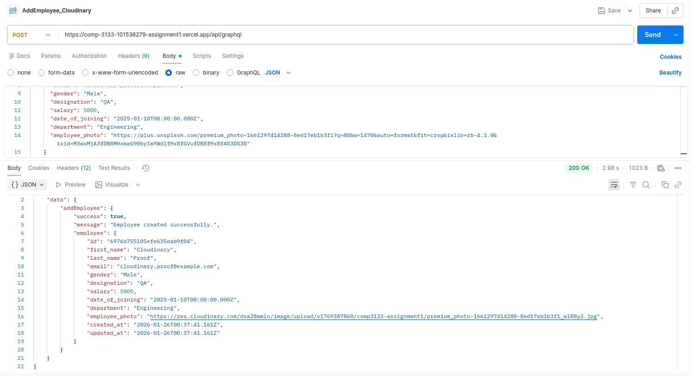
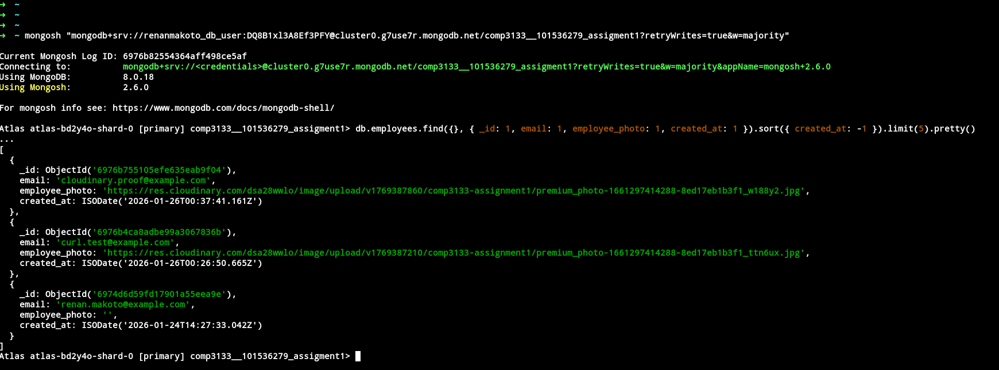

# COMP3133 Assignment 1 - GraphQL Employee Management System

<h2 align="center">Technologies Used</h2>

  
  
  
  

Live URLs and credentials

Backend base URL: https://comp-3133-101536279-assignment1.vercel.app/

API base path for testing: https://comp-3133-101536279-assignment1.vercel.app/api/graphql

Sample user credentials for testing:

Email: renan@example.com
Username: renan
Password: Password123

Live API endpoints (all are POST with Content-Type: application/json)

- GraphQL endpoint (all operations): https://comp-3133-101536279-assignment1.vercel.app/api/graphql
- GraphQL endpoint (rewrite): https://comp-3133-101536279-assignment1.vercel.app/graphql

Operations (operationName values)
- Signup (operationName: Signup)
- Login (operationName: Login)
- Get all employees (operationName: GetAllEmployees)
- Search employees (operationName: SearchEmployees)
- Create a new employee (operationName: AddEmployee)
- Get employee by ID (operationName: GetEmployeeById)
- Update employee by ID (operationName: UpdateEmployeeById)
- Delete employee by ID (operationName: DeleteEmployeeById)

Proof of Cloudinary usage
- Postman upload and API response showing Cloudinary URL stored for `employee_photo`:

  

- Mongo shell showing Cloudinary URL persisted in the `employees` collection:

  
